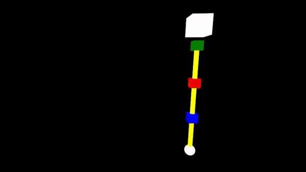
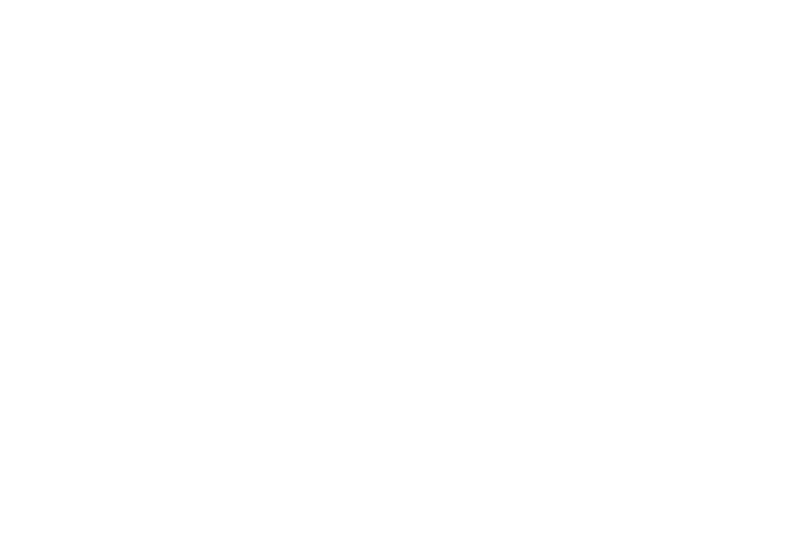

# Forward and Inverse Kinematics of a 3-DOF Arm

  
  
Full demo video <a href="https://www.youtube.com/watch?v=q4ilPCmvRKg&ab_channel=FezaroGaming">here</a>

## Overview

This project aims to simulate the forward and inverse kinematics of a 3-DOF (Degree of Freedom) robotic arm using the
threepp library. It provides a visual representation and control interface for manipulating the arm's joints and links.

## Features

- **Forward Kinematics:** Calculate the end effector position based on given joint angles.
- **Inverse Kinematics:** Determine the required joint angles to achieve a desired end effector position using cyclic coordinate decent.
- **Dynamic Link Length:** Change the length of the links to observe the effect on the arm's movement.
- **Interactive UI:** Use ImGui for real-time control and visualization of the kinematics.
- **3D Visualization:** Render the arm and its joints in a 3D environment.
- **Cross-Platform:** Support for Windows, macOS, and Linux.

## Usage

- Use the switch to toggle between forward and inverse kinematics.
- Drag the sliders to adjust the joint angles og target position.
- Click reset to set the arm to its initial position.
- Play different animations in inverse kinematics mode using the drop down menu.

## Dependencies

- **threepp:** A C++ library for 3D graphics
  (https://github.com/markaren/threepp)
- **ImGui:** A graphical user interface for C++
  (https://github.com/ocornut/imgui)

## UML Class Diagram

## Main Scripts

- **main.cpp:** Entry point of the application, initializes the window and runs the main loop.
- **testFunctions.cpp:**  Tests different functions for the ChainKinematics class.

## Additional Information

Make sure to have the following installed:

- CMake 3.19 or later
- A C++20 compatible compiler

The test functions can be disabled by setting `PROJECT_BUILD_TESTS` to `OFF` in the `CMakeLists.txt` file.

Have fun exploring the kinematics of the robotic arm!
